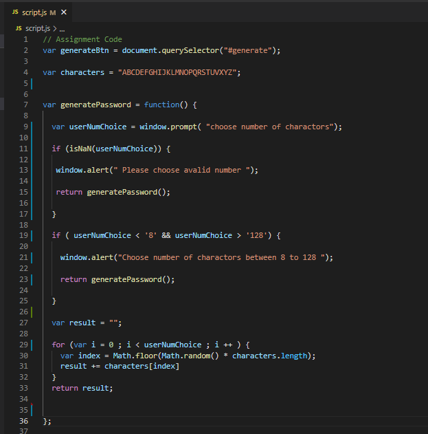
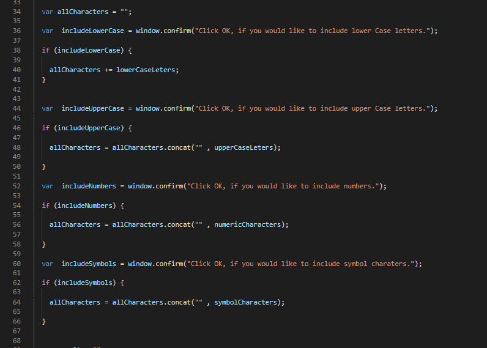
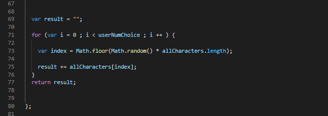
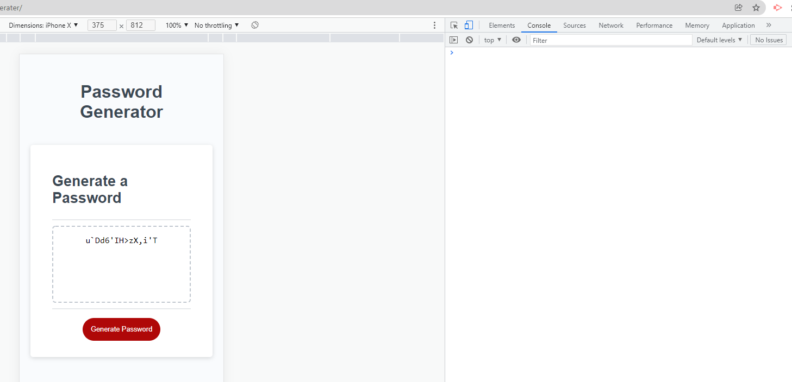

# Password-Generater

## Description

An employee with access to sensitive data wants to randomly generate a password that meets certain criteria.

SO THAT he can create a strong password that provides greater security.

We need to modify starter code to create an application that enables employees to generate random passwords based on criteria that they’ve selected by:

1- Find the missing function and write you code to make it work.

2- Breake down the function and work with one type of characters.

3- Add variable strings for all possible charactors.

4- Work with user choices by using prompt(), alert() and confirm().

5- join strings of characters after each of user choice by using ( += ) or ( .concat).

6- After completing all user choices, use for loop and math.random to create the password depending on number of charactors the user chose.

7- Open the page, try your code and inspect the console.

## Instalation

Please use the following link to view the web page after modification : [GitHub Pages](https://samer-balee.github.io/Password-Generater/).

GitHub link : [Samer-Balee](https://github.com/Samer-Balee/Password-Generater).

## Usfull Resourses

. [MDN WEB DOCS](https://developer.mozilla.org/en-US/docs/Web/JavaScript)

## Usage

 . Breaking down the code 

 . Working on user choices 

 . Using for loop 

 . Inspect your code 

